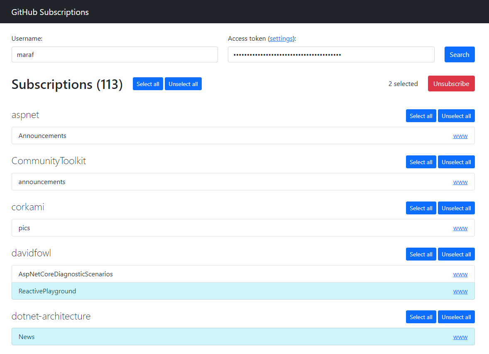

# GitHub Subscription Manager

Super simple Blazor WebAssembly application for bulk unsubscribing from GitHub repository subscriptions.

## Security

The application is completly client-side. Your access token is not stored anywhere. Source code is intentionally placed in a single file, so you can easily review it.
